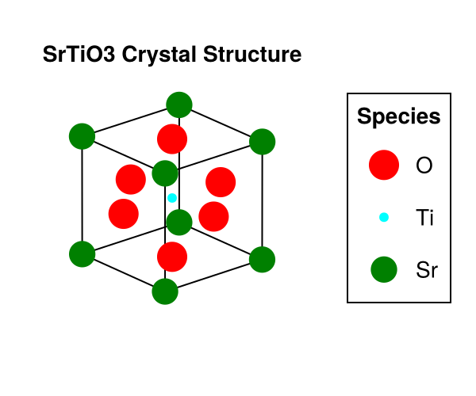

# CrystalStructurePrediction

[](https://github.com/Br0kenSmi1e/CrystalStructurePrediction.jl/actions/workflows/CI.yml?query=branch%3Amain)
[](https://codecov.io/gh/Br0kenSmi1e/CrystalStructurePrediction.jl)

CrystalStructurePrediction is a Julia package for predicting crystal structures from a given set of ions and their charges.
The method is based on the integer programming formulation that detailed in [^Gusev2023].

## Usage
1. Install the package: open Julia REPL and run
```julia
] dev https://github.com/Br0kenSmi1e/CrystalStructurePrediction.jl.git
```

2. Run the example: open a terminal and run
```bash
cd ~/.julia/dev/CrystalStructurePrediction
make init  # initialize the project
make run-example  # run the SrTiO3 example
```

If everything goes well, you should see the following crystal structure visualization:



The center is Ti, surrounded by Sr (corner) and O (face center).

## Reference
[^Gusev2023] Gusev, V.V., Adamson, D., Deligkas, A., Antypov, D., Collins, C.M., Krysta, P., Potapov, I., Darling, G.R., Dyer, M.S., Spirakis, P., Rosseinsky, M.J., 2023. Optimality guarantees for crystal structure prediction. Nature 619, 68–72. https://doi.org/10.1038/s41586-023-06071-y
